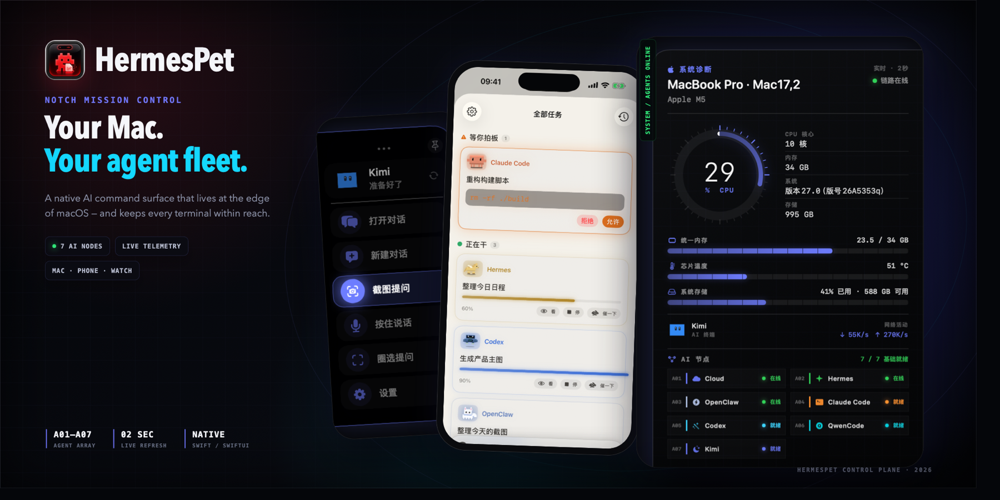

# HermesPet · AI Mission Control

**Bring AI into your MacBook's notch — and bring different AI endpoints into one observable control plane.**

Native macOS AI desktop companion · 7 AI endpoints · system telemetry · parallel work · companion apps in development

 

🇨🇳 [简体中文](./README.md) · 🇺🇸 **English**

### [Download the latest DMG](https://github.com/basionwang-bot/HermesPet/releases/latest) · [Visit the website](https://hermespet.cc) · [Send feedback](https://github.com/basionwang-bot/HermesPet/issues)

The official DMG is Developer ID-signed and Apple-notarized. Open it and drag “Hermes 桌宠” to Applications.

---

## AI should not live in only one chat window

HermesPet makes AI part of your macOS desktop: the notch becomes a live task entry point, the screen edge becomes an always-ready console, and the pet changes with your current AI mode, notifies you when work is done, and accepts files and images you drop onto it.

It can connect to cloud models as well as locally authenticated terminals such as Claude Code, Codex, QwenCode, and Kimi. Conversations can keep working independently; you see more than a final answer — connection state, execution steps, system load, and task progress are visible too.

> HermesPet is not another chat-wrapper window. Its goal is to become the **AI Mission Control** on your desktop.

From edge-of-screen shortcuts, to a mobile task dashboard, to live diagnostics on the opposite side.

---

## HermesPet in one minute

| Notch & screen edge | Multi-Agent control plane | Cross-device handoff |
|---|---|---|
| Chat, screenshots, voice, and completion notifications without breaking your flow. | Cloud, Hermes, OpenClaw, Claude Code, Codex, QwenCode, and Kimi are shown together; multi-Agent orchestration can grow from here. | The Mac performs the work; iPhone and Apple Watch are for observing, confirming, and handing work off. Companion apps are still in development. |

### 01 · The screen edge is your task console

Hover over the pet and the sidebar opens from the edge of the display. Frequent actions stay nearby, while the other side shows live system diagnostics: CPU, memory, temperature, storage, network activity, and AI-node states — without opening a full window first.

### 02 · One desktop, seven AI endpoints

| Node | Best for | How it connects |
|---|---|---|
| **Cloud / Online AI** | Everyday questions, writing, summaries, visual understanding | Choose a provider in the app and configure your own API key |
| **Hermes** | OpenAI-compatible gateways, self-hosted models, internal company models | Configure a compatible endpoint and model |
| **OpenClaw** | Gateway-style AI platforms and multi-model aggregation | Install and run OpenClaw |
| **Claude Code** | Reading and editing files, commands, complex engineering tasks | Reuse the local Claude Code sign-in |
| **Codex** | Coding tasks, tool use, and visual generation | Reuse the local Codex sign-in |
| **QwenCode** | Qwen terminal workflows | Reuse the local QwenCode sign-in |
| **Kimi** | Kimi terminal workflows and long-context tasks | Reuse the local Kimi sign-in |

Uninstalled terminals never block the basic experience. On first launch, most people only need to choose one cloud AI provider; advanced terminals can be enabled later when needed.

### 03 · Mac does the work; phone lets you observe, ask, and confirm

The iPhone companion is designed around remotely supervising the Agent on your Mac: view active tasks, receive progress, approve higher-risk actions, upload images or files, and continue a conversation away from the computer. Apple Watch is intended for lighter-weight status and reminders.

> The phone and watch companions are still under active development and are not included in the macOS DMG. Their public availability will be announced separately.

---

## The interface in context

<table>
<tr>
<td width="50%" align="center">

 <b>Native chat workspace</b> Multiple conversations, Markdown, files, images, and execution steps
</td>
<td width="50%" align="center">

 <b>Knowledge graph</b> Turn long-running conversations into a searchable, revisitable topic map
</td>
</tr>
</table>

<table>
<tr>
<td align="center" width="33%">

 <b>Daily companion</b> Briefings, familiar AI, and cross-device entry points
</td>
<td align="center" width="33%">

 <b>Agent task board</b> Watch progress, stop tasks, and approve sensitive actions
</td>
<td align="center" width="33%">

 <b>Hand it to your Mac</b> Photos, files, voice, and remote tasks
</td>
</tr>
</table>

---

## What you can do with it

- **Parallel conversations**: each conversation has its own AI mode. Work can keep running in the background, with the Dynamic Island and pet notifying you when it finishes.
- **Visible execution**: file reads, commands, tool calls, and errors are presented together — not just a vague “thinking” state.
- **Screenshots and region questions**: capture the whole screen or a selected area and give it to the current AI to explain, extract, or work on.
- **Push to talk**: use a global shortcut in any app, hold to speak, and release to send.
- **Drop files onto the pet**: drag images and documents into chat or directly to the pet at the edge of your screen.
- **System diagnostics**: view CPU, memory, temperature, storage, live network activity, and AI-terminal connection states together.
- **Long-term memory and knowledge graph**: keep conversation history locally and revisit it by keyword, topic, or importance.
- **Scheduled work and automation**: daily briefings, recurring reviews, and task scheduling are gradually being brought into the same control plane.

<b>View common shortcuts</b>

| Shortcut | Action |
|---|---|
| `⌘⇧H` | Show or hide the chat window |
| `⌘⇧J` | Capture a screenshot and attach it to the current conversation |
| `⌘⇧V` | Hold to talk; release to send |
| `⌘⇧Space` | Open the quick-question window |
| `⌘⇧L` | Start continuous voice conversation |
| `⌘⇧N` | Open AI notes |
| `⌘⇧G` | Open the knowledge graph |

---

## Installation

### Recommended: download the official DMG

1. Open [GitHub Releases](https://github.com/basionwang-bot/HermesPet/releases/latest).
2. Choose the build that matches the chip shown in About This Mac:

   | Your Mac | Download |
   |---|---|
   | Apple M-series chip | `HermesPet-*-AppleSilicon.dmg` |
   | Intel chip | `HermesPet-*-Intel.dmg` |

3. Open the DMG and drag “Hermes 桌宠” to Applications.
4. Launch it from Launchpad or Spotlight, then select an AI provider and enter your configuration in Settings.

HermesPet includes update checks. The release build is signed and notarized, so system permissions are more stable across upgrades; most people do not need to build it from source.

### Optional: unlock terminal-based Agents

Claude Code, Codex, QwenCode, Kimi, and OpenClaw are optional. Complete the official installation and sign-in for the tool in Terminal first, then return to HermesPet and recheck it. Cloud AI works normally even when none of those tools are installed.

---

## Data, privacy, and network boundaries

We want to be plain and precise about where data goes:

- Desktop data such as conversations, images, and task records is stored primarily in local directories on your Mac.
- When you ask an AI a question, the request goes to the model provider or terminal tool that you deliberately selected and configured. Each provider has its own privacy policy.
- API keys and connection settings are stored locally by the Mac client. HermesPet does not create or resell model accounts for you.
- Only when you enable remote phone features do the Mac and companion app use account authentication and an official relay service for internet communication.
- Remote access is not “iCloud only, with no server involved.” Account, transport, and retention boundaries will be documented further before the feature is publicly released.
- Screen viewing, microphone, and accessibility permissions are requested only when a feature needs them, and macOS lets you decide through its normal prompts.

---

## Official channels and authenticity

| Channel | Link |
|---|---|
| Website | [hermespet.cc](https://hermespet.cc) |
| Public repository | [github.com/basionwang-bot/HermesPet](https://github.com/basionwang-bot/HermesPet) |
| Official download | [GitHub Releases](https://github.com/basionwang-bot/HermesPet/releases/latest) |
| Feedback | [GitHub Issues](https://github.com/basionwang-bot/HermesPet/issues) |
| Contact | [basionwang@gmail.com](mailto:basionwang@gmail.com) |

Official releases are signed with Team ID **`R34KL4X4D9`**. Builds from outside this repository and website are not official releases and cannot be assumed unmodified.

> This public repository is for product information, official downloads, release notes, and Issue feedback. To install HermesPet, use the signed and notarized DMG.

---

## Roadmap

HermesPet is evolving from a single AI pet into an observable, schedulable multi-Agent desktop system. Next priorities include:

- More reliable health checks and sign-in-state detection for AI terminals
- Parallel multi-Agent orchestration, role creation, and result synthesis
- Scheduled jobs, run monitoring, and anomaly notifications
- Fuller task handoff between Mac, iPhone, and Apple Watch
- Clearer privacy documentation and permission controls for remote access

See [todo.md](./todo.md) for public items. Feedback and feature requests are welcome in [Issues](https://github.com/basionwang-bot/HermesPet/issues).

---

## Support the project

HermesPet is designed, built, and maintained long-term by an independent developer. A Star, a reproducible Issue, or sharing it with someone who genuinely needs desktop AI all help the project continue.

<b>Contact the author / WeChat</b>

Please mention “HermesPet” when you add me.

### Star History

---

**Made with ✦ on a MacBook**

Desktop AI should feel alive — and remain transparent and controllable.

© 2024–2026 [Basion Wang](https://github.com/basionwang-bot). All rights reserved.

